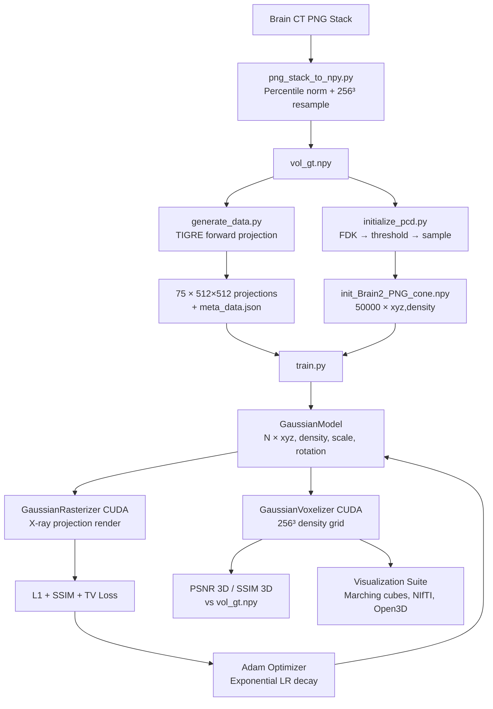

# Thesis (Defence) - Gaussian Splatting for Sparse-View CT Reconstruction
### Adapting Differentiable Radiative Rendering to Volumetric Medical Imaging

> **Thesis Defence Project** — Applying R²-Gaussian (NeurIPS 2024) to brain CT reconstruction with a custom visualization and evaluation suite.

---

## The Problem

Computed tomography reconstructs internal anatomy by inverting the X-ray projection operator: hundreds of 2D intensity measurements at different angles must be combined to recover a coherent 3D density volume. Classical algorithms — filtered back-projection (FDK), iterative solvers (SART, CGLS), total-variation minimization — are well understood but carry a fundamental constraint: reconstruction quality degrades sharply as the number of projections decreases.

Sparse-view CT — acquiring only 25–75 projections instead of the clinical 700–2000 — is an active area of research for two reasons:

1. **Dose reduction**: each projection contributes measurable radiation dose. Fewer projections directly translates to lower patient exposure.
2. **Reconstruction speed**: iterative methods on full-angle datasets can take hours. Sparse systems are computationally tractable but severely underdetermined.

This project investigates whether a **3D Gaussian scene representation**, trained end-to-end via differentiable rendering, can outperform or meaningfully complement classical reconstruction algorithms in the sparse-view regime — applied to human brain CT data.

---

## Technical Motivation

### Why Differentiable Rendering?

Differentiable rendering treats the image formation process as a differentiable function of scene parameters. Rather than solving a reconstruction problem through a fixed algebraic operator (as FDK does), we define a parameterized scene and optimize it directly so that its *simulated* projections match the *observed* projections. The scene parameters — in this case, the positions, shapes, and densities of 3D Gaussians — are learned via gradient descent.

This framing turns CT reconstruction into an inverse rendering problem: a discipline with deep theoretical grounding in computer vision and powerful engineering tooling in modern automatic differentiation frameworks.

### The X-ray Rendering Model

X-ray intensity follows the Beer-Lambert law: photon attenuation along a ray is an exponential of the integrated linear attenuation coefficient along the path. For thin structures relative to projection angle, this line integral can be modeled as a sum of Gaussian footprint contributions along the ray. The R²-Gaussian framework formalizes this: each 3D Gaussian represents a localized density blob, and its contribution to a 2D projection is computed as an analytic 2D projection of its 3D Gaussian shape — a computationally efficient approximation of the full line integral.

### Why Gaussian Splatting, Not NeRF?

Neural Radiance Fields (NeRF) methods require querying a neural network per sample point — expensive and slow to converge on high-resolution 3D grids. 3D Gaussian Splatting (3DGS, Kerbl et al., SIGGRAPH 2023) is an explicit representation: no network, direct optimization of geometric primitives. It offers:

- **Speed**: 5–15 minutes to converge versus hours for NeRF-based CT methods
- **Interpretability**: each Gaussian has a clear physical interpretation as a local density blob
- **Adaptive resolution**: density control mechanisms dynamically concentrate Gaussians where the scene is complex
- **Exact gradients**: the tile-based rasterizer is fully differentiable through CUDA backward passes

---

## System Overview

```
┌─────────────────────────────────────────────────────────────────┐
│                        INPUT DATA                               │
│  Brain CT PNG stack  →  vol_gt.npy (256³)                      │
│  TIGRE forward projection  →  75 X-ray projections (512×512)   │
└─────────────────────────┬───────────────────────────────────────┘
                          │
                          ▼
┌─────────────────────────────────────────────────────────────────┐
│                     INITIALIZATION                              │
│  FDK reconstruction  →  threshold & sample  →  50k init points │
│  (x, y, z, density) in scanner-normalized [-1,1]³ space        │
└─────────────────────────┬───────────────────────────────────────┘
                          │
                          ▼
┌─────────────────────────────────────────────────────────────────┐
│                   GAUSSIAN OPTIMIZATION                         │
│                                                                 │
│  For each iteration (30,000 steps):                            │
│  1. Sample a training projection                               │
│  2. Render via GaussianRasterizer (CUDA)                       │
│     └─ X-ray projection = Σ density_i · Gaussian2D_i          │
│  3. Compute L1 + SSIM loss on rendered vs GT projection        │
│  4. Compute 3D Total Variation on a random 32³ sub-volume      │
│  5. Backpropagate → update {xyz, density, scale, rotation}     │
│  6. Adaptive densification: clone/split/prune Gaussians        │
└─────────────────────────┬───────────────────────────────────────┘
                          │
                          ▼
┌─────────────────────────────────────────────────────────────────┐
│                  VOLUME EXTRACTION                              │
│  GaussianVoxelizer (CUDA) → 256³ density grid                  │
│  Compare to vol_gt.npy → PSNR (3D), SSIM (3D per-axis)        │
└─────────────────────────┬───────────────────────────────────────┘
                          │
                          ▼
┌─────────────────────────────────────────────────────────────────┐
│                  VISUALIZATION SUITE                            │
│  Marching cubes mesh · Slice viewer · Multi-angle renders       │
│  Open3D scene viewer · NIfTI export (3D Slicer compatible)     │
└─────────────────────────────────────────────────────────────────┘
```

---

## Key Technical Contributions

### 1. X-ray Rendering Adaptation (CUDA)

The core rendering engine is a custom CUDA extension (`xray-gaussian-rasterization-voxelization`) derived from the original 3DGS rasterizer with three fundamental modifications:

- **Single-channel density rendering**: RGB channels replaced with scalar attenuation density. `NUM_CHANNELS=1` throughout the CUDA pipeline.
- **Dual projection geometry**: The rasterizer supports both **parallel beam** (orthographic) and **cone beam** (perspective) CT scanner geometries, selecting the appropriate Jacobian for the EWA splatting covariance projection.
- **Additive accumulation**: Standard 3DGS alpha-composites for RGB rendering. X-ray follows an additive line-integral model — each Gaussian contributes its projected footprint to the total attenuation independently.

### 2. Dual-Mode CUDA Pipeline: Rasterizer + Voxelizer

Two separate CUDA kernels are required:
- **GaussianRasterizer**: 2D tile-based projection for training (16×16 pixel tiles, depth-sorted Gaussians)
- **GaussianVoxelizer**: 3D voxel accumulation for reconstruction evaluation (8×8×8 voxel thread blocks)

Both support full autograd through custom CUDA backward passes, enabling end-to-end gradient flow from 3D reconstruction metrics.

### 3. Scanner-Aware Camera Parameterization

Camera poses are derived from scanner geometry rather than photographic calibration:

```python
# Camera-to-world from scanner parameters
R = R_angle @ R_90z @ R_-90x
T = [DSO·cos(θ), DSO·sin(θ), 0]
```

The system supports the full CT scanner parameter space: source-to-detector distance (DSD), source-to-origin distance (DSO), detector dimensions, voxel spacing, and origin offset — all correctly propagated through the projection matrix construction.

### 4. Scene Normalization and Scale Consistency

The entire scene (scanner geometry, projection intensities, voxel coordinates) is uniformly scaled into a `[-1,1]³` unit cube before training:

```python
scene_scale = 2 / max(scanner_cfg["sVoxel"])
```

This normalization is applied consistently to all spatial quantities and projection intensities, ensuring numerical stability in the CUDA EWA splatting arithmetic.

### 5. Physics-Informed Loss Design

Training loss combines three terms operating at different spatial scales:

| Term | Domain | Physical Justification |
|------|--------|----------------------|
| L1 projection | 2D | Direct data fidelity in projection space |
| 1−SSIM | 2D | Structural coherence across spatial frequencies |
| 3D Total Variation | 3D (random 32³ crop) | Piecewise-smooth prior — CT tissue is locally uniform |

The TV loss samples a random sub-volume at each iteration, providing regularization without querying the full 256³ grid every step.

### 6. Visualization and Analysis Suite

A comprehensive visualization toolkit was developed for the thesis:

- **25+ anatomy-specific 3D rendering scripts** using marching cubes and matplotlib 3D projection
- **Animated GIF generation** for rotational visualization of reconstructed volumes
- **Open3D scene viewer** integrating camera frustum geometry, volume mesh, and coordinate frames
- **3D Slicer export** (`.nii.gz`) for clinical-grade volumetric inspection
- **Gaussian cloud visualizer** rendering each Gaussian as a scaled 3D ellipsoid
- **Comparative volume slicer** with interactive slider for ground-truth vs reconstruction inspection

---

## Pipeline Architecture (Detailed)



---

## Installation

### Prerequisites

- CUDA 11.8 + compatible NVIDIA GPU (≥16GB VRAM recommended)
- Anaconda or Miniconda
- MSVC (Windows) or GCC (Linux) for CUDA extension compilation

### Environment

```bash
git clone https://github.com/i-am-mushfiq/r2_gaussian.git --recursive
cd r2_gaussian

# Create conda environment
conda env create --file environment.yml
conda activate r2_gaussian_new

# Install PyTorch with CUDA 11.8
pip install torch==2.0.1+cu118 torchvision==0.15.2+cu118 \
    --index-url https://download.pytorch.org/whl/cu118

# Windows only
SET DISTUTILS_USE_SDK=1

# Build and install CUDA extensions
pip install -e r2_gaussian/submodules/xray-gaussian-rasterization-voxelization \
    --no-build-isolation
pip install -e r2_gaussian/submodules/simple-knn \
    --no-build-isolation
```

### TIGRE (CT simulation toolkit)

```bash
wget https://github.com/CERN/TIGRE/archive/refs/tags/v2.3.zip
unzip v2.3.zip
pip install TIGRE-2.3/Python --no-build-isolation

# Verify installation
python r2_gaussian/dummy_TIGRE_run.py
```

---

## Dataset Expectations

### Supported Input Formats

**Format 1 — NeRF/Blender** (recommended for new data):
```
<dataset>/
├── meta_data.json          # Scanner config + projection file list
├── vol_gt.npy              # Ground truth volume (optional for real data)
├── init_<name>.npy         # Initial point cloud (generated by initialize_pcd.py)
├── proj_train/             # Training projections as float32 .npy files
│   └── proj_train_XXXX.npy
└── proj_test/              # Test projections
    └── proj_test_XXXX.npy
```

**Format 2 — NAF pickle** (for SAX-NeRF compatibility):
Single `.pickle` file containing all projections, geometry, and ground-truth volume.

### Scanner Configuration (meta_data.json)

```json
{
  "scanner": {
    "mode": "cone",          // or "parallel"
    "DSD": 7.0,              // Source-Detector distance [meters]
    "DSO": 5.0,              // Source-Origin distance [meters]
    "nDetector": [512, 512], // Detector resolution [v, u]
    "sDetector": [4.0, 4.0], // Detector physical size [v, u] [meters]
    "nVoxel": [256, 256, 256],
    "sVoxel": [2.0, 2.0, 2.0],
    "totalAngle": 360.0,
    "startAngle": 0.0
  }
}
```

### Preprocessing New Volumes

For a PNG slice stack from any CT scanner:
```bash
python r2_gaussian/png_stack_to_npy.py \
    <png_folder> <output.npy> \
    [target_size=256] \
    [spacing_z spacing_y spacing_x]
```

---

## Training and Usage

### Step 1: Generate Dataset (synthetic)

```bash
python data_generator/synthetic_dataset/generate_data.py \
    --vol data_generator/synthetic_dataset/Brain2_PNG.npy \
    --scanner data_generator/synthetic_dataset/scanner/cone_beam.yml \
    --output data/cone_ntrain_75_angle_360 \
    --n_train 75 \
    --n_test 100
```

### Step 2: Initialize Point Cloud

```bash
python initialize_pcd.py \
    --data data/cone_ntrain_75_angle_360/Brain2_PNG_cone \
    --recon_method fdk \
    --n_points 50000
```

### Step 3: Train

```bash
python train.py \
    -s data/cone_ntrain_75_angle_360/Brain2_PNG_cone \
    -m output/my_experiment \
    --iterations 30000 \
    --lambda_tv 0.05 \
    --lambda_dssim 0.2
```

**Key hyperparameters**:
| Parameter | Default | Effect |
|-----------|---------|--------|
| `--iterations` | 30000 | Total training steps |
| `--lambda_tv` | 0.05 | 3D total variation weight |
| `--lambda_dssim` | 0.25 | SSIM loss weight |
| `--max_num_gaussians` | 500000 | Cap on Gaussian count |
| `--densify_until_iter` | 15000 | Adaptive control duration |
| `--scale_min / scale_max` | 0.0005 / 0.5 | Gaussian size bounds (fraction of volume) |

### Step 4: Evaluate

```bash
python test.py -m output/my_experiment
```

Outputs per-iteration PSNR/SSIM in 2D (projection) and 3D (volume), plus `.nii.gz` files for 3D Slicer.

### Step 5: Visualize

```bash
# Scene geometry: cameras + volume mesh
python scripts/visualize_scene.py -s data/cone_ntrain_75_angle_360/Brain2_PNG_cone

# 3D Gaussian visualization (trained model)
python 3D_vis/3D_vis.py

# Comparative volume inspector
# (from Python REPL or notebook)
from r2_gaussian.utils.plot_utils import show_two_volume
import numpy as np
show_two_volume(vol_gt, vol_pred, title1="GT", title2="R2-Gaussian")
```

### Batch Training (Multiple Cases)

```bash
python scripts/train_all.py \
    --source data/synthetic_dataset/cone_ntrain_75_angle_360 \
    --output output/synthetic_dataset/cone_ntrain_75_angle_360 \
    --device 0
```

### Traditional Baseline Comparison

```bash
python scripts/run_traditional_methods.py \
    --data data/Brain2_PNG_cone.pickle \
    --methods fdk sart cgls asd_pocs \
    --output output/baselines/
```

---

## Research Direction

### Open Problems

**1. Sparse-view regime**  
The primary unanswered question is the reconstruction quality curve as a function of projection count. Generating 10-view, 25-view, and 50-view datasets from the Brain2 CT and running comparative experiments would characterize where Gaussian splatting outperforms classical algorithms and where it degrades.

**2. Initialization sensitivity**  
FDK initialization quality depends strongly on the scanner geometry. For brain CT in particular — which has complex soft-tissue contrast and is far from the bony structures FDK reconstructs cleanly — the initialization may be systematically poor. Exploring random initialization or perturbed FDK initialization is a natural next step.

**3. Regularization design**  
The current 3D TV loss samples a random 32³ sub-volume at each iteration. A more principled regularization — guided by known CT tissue properties (piecewise constant in bone, smooth in soft tissue, structured in vascular) — could significantly improve reconstruction quality.

**4. Real vs synthetic projection gap**  
Current training uses TIGRE-synthesized projections with simplified noise models. Real clinical CT projections include beam hardening, scatter, detector non-linearity, and truncation artifacts absent from synthetic data. Bridging this gap is essential for clinical applicability.

**5. Scalability**  
The 256³ volume at 75 projections is a modest regime. Understanding how this method scales to 512³ volumes and full-angle acquisition (simulating reduced-dose clinical data) is an open research question.

### Clinical Implications

If Gaussian splatting can produce diagnostically acceptable reconstructions from 20–50 projections (versus clinical standards of 700–2000), the implications for interventional radiology — where real-time C-arm CT is common — would be significant. The method's speed (5–15 minutes on a consumer GPU) and explicit representational form (no black-box neural network) are properties aligned with clinical requirements for interpretability and latency.

---

## Technical Stack

### Rendering Stack
| Component | Technology |
|-----------|-----------|
| X-ray projection | Custom CUDA 11.8 tile rasterizer |
| Volume extraction | Custom CUDA 11.8 voxelizer (8³ thread blocks) |
| Covariance math | GLM (OpenGL Mathematics) |
| CT simulation | TIGRE v2.3 (CERN) |

### ML Stack
| Component | Technology |
|-----------|-----------|
| Framework | PyTorch 2.0 |
| Optimizer | Adam (ε=1e-15) |
| LR schedule | Exponential decay per parameter group |
| Logging | TensorboardX |
| Metrics | PSNR, SSIM (2D per-projection, 3D per-axis-slice) |

### Visualization Stack
| Component | Technology |
|-----------|-----------|
| 3D mesh | Open3D 0.18, marching cubes (skimage) |
| Volume slicing | matplotlib + interactive Slider |
| Medical export | SimpleITK (NIfTI .nii.gz) |
| Point cloud | Open3D |
| Animation | matplotlib savefig multi-angle loop |

---

## Repositories

This thesis project lives across two forked GitHub repositories:

| Repo | Fork | Upstream |
|------|------|----------|
| **r2_gaussian** — primary research codebase | [i-am-mushfiq/r2_gaussian](https://github.com/i-am-mushfiq/r2_gaussian) | [Ruyi-Zha/r2_gaussian](https://github.com/Ruyi-Zha/r2_gaussian) |
| **gaussian-splatting** — 3DGS baseline reference | [i-am-mushfiq/gaussian-splatting](https://github.com/i-am-mushfiq/gaussian-splatting) | [graphdeco-inria/gaussian-splatting](https://github.com/graphdeco-inria/gaussian-splatting) |

```
r2_gaussian/                        # Primary research codebase
├── train.py                        # Training entry point
├── test.py                         # Evaluation entry point
├── initialize_pcd.py               # FDK-based initialization
├── png_stack_to_npy.py             # Volume preprocessing
├── r2_gaussian/                    # Core library
│   ├── gaussian/                   # Scene representation + rendering
│   ├── dataset/                    # Data loading + camera
│   ├── utils/                      # Losses, metrics, visualization
│   └── submodules/                 # CUDA extensions
│       ├── xray-gaussian-rasterization-voxelization/
│       └── simple-knn/
├── data_generator/                 # Synthetic CT generation (TIGRE)
├── scripts/                        # Batch training, baselines, format conversion
├── 3D_vis/                         # Per-anatomy visualization suite
└── environment.yml

gaussian-splatting/                 # Upstream 3DGS baseline (reference, separately forked)
```

---

## Limitations

This work adapts an existing method (R²-Gaussian, NeurIPS 2024) and applies it to a new dataset (brain CT). Several limitations should be stated explicitly:

1. **No clinical validation**: All experiments use synthetic X-ray projections generated by the TIGRE forward model. Generalization to real clinical CT acquisitions is not demonstrated.

2. **Single dataset**: Experiments are conducted on one brain CT volume. The method's generalization across different brain anatomy, pathologies, or acquisition protocols is unknown.

3. **3D reconstruction quality**: Current experiments produce 3D PSNR values (~6 dB) substantially below those reported in the R²-Gaussian paper for standard benchmark datasets. The causes include potential scanner parameter mismatch and disabled densification — these are active areas of investigation.

4. **Computational requirements**: A consumer-grade research GPU (≥16GB VRAM) is required. Real-time clinical use would require further optimization.

5. **No learned prior**: Unlike NeRF-based methods with pretrained networks, R²-Gaussian trains from scratch per-scene. This makes it interpretable but limits its ability to exploit cross-patient anatomical priors.

6. **Approximate physics**: The Gaussian splatting approximation does not model scattering, beam hardening, or detector physics. These effects can be significant in real CT acquisitions.

---

## Citation

This project is built on R²-Gaussian (NeurIPS 2024):

```bibtex
@inproceedings{r2_gaussian,
  title     = {R$^2$-Gaussian: Rectifying Radiative Gaussian Splatting for Tomographic Reconstruction},
  author    = {Ruyi Zha and Tao Jun Lin and Yuanhao Cai and Jiwen Cao and Yanhao Zhang and Hongdong Li},
  booktitle = {Advances in Neural Information Processing Systems (NeurIPS)},
  year      = {2024}
}
```

Built on 3D Gaussian Splatting:

```bibtex
@Article{kerbl3Dgaussians,
  author  = {Kerbl, Bernhard and Kopanas, Georgios and Leimk{\"u}hler, Thomas and Drettakis, George},
  title   = {3D Gaussian Splatting for Real-Time Radiance Field Rendering},
  journal = {ACM Transactions on Graphics},
  volume  = {42}, number = {4},
  year    = {2023}
}
```

CT simulation via TIGRE:

```bibtex
@article{biguri2016tigre,
  title   = {TIGRE: a MATLAB-GPU toolbox for CBCT image reconstruction},
  author  = {Biguri, Ander and Dosanjh, Manjit and Hancock, Steven and Soleimani, Manuchehr},
  journal = {Biomedical Physics \& Engineering Express},
  volume  = {2}, number = {5},
  year    = {2016}
}
```

---

## License

This project inherits the non-commercial research license from 3D Gaussian Splatting. See [gaussian-splatting/LICENSE.md](gaussian-splatting/LICENSE.md). The TIGRE toolbox is licensed under its own BSD-style license.
